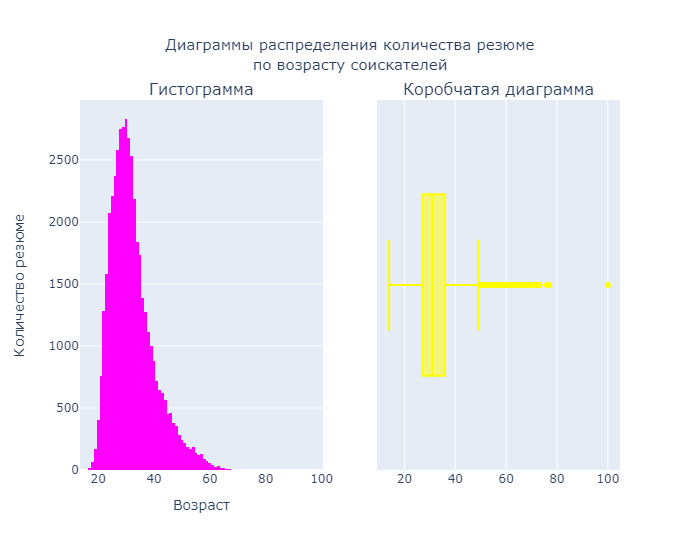
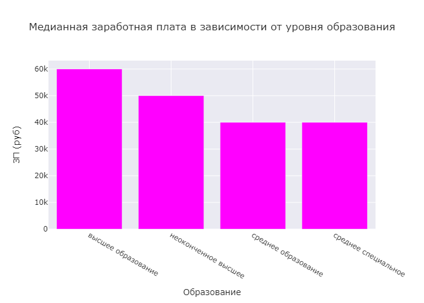

# <center> Преобразование, визуализация и очистка данных </center>

## Оглавление

1. [Описание проекта](#описание-проекта)

2. [Описание данных](#описание-данных)

3. [Зависимости](#используемые-зависимости)

4. [Установка проекта](#установка-проекта)

5. [Авторы](#авторы)

6. [Преобразование данных](#преобразование-данных)

6. [Выводы](#выводы)

## Описание проекта

>Компания HeadHunter хочет построить модель, которая бы автоматически определяла примерный уровень заработной платы, подходящей пользователю, исходя из информации, которую он указал о себе. Прежде чем построить модель, данные необходимо преобразовать, исследовать и очистить.


**Преобразование данных** - это процесс преобразования данных к виду, удобному для из визуализации и анализа.

**Визуализация данных** – это процесс подготовки данных из исходного набора и собственно их визуализации в виде различного рода диаграмм и графиков. Визуализация данных является инструментом для анализа данных и построения различных моделей.

**Очистка данных** - это процесс поиска и борьбы с некорректными данными, включая пропуски, выбросы и собственно некорректные данные.

Основные этапы преобразования данных:

* Получение отфильтрованных наборов данных.

* Получение различного рода сгруппированных промежуточных наборов данных.

* Получение конечных наборов данных для визуализации путем различных преобразований промежуточных данных.

**Цель анализа данных** — получение знаний (о пользователях, исходя из информации, которую они указывают о себе), необходимых для реализации модели.


**О структуре проекта:**

Исходный файл представляет собой DataFrame из 44744 объектов (резюме соискателей) с 12 признаками (пол, возраст, город, опыт работы и т.д., Dtype = 'object'). В трех из них присутствуют пропуски.

* [data](https://drive.google.com/drive/folders/1_mCdsz_nc_NxgCDpYHfgvg8nZyg_hJpI?usp=sharing) - папка с исходными табличными данными

* [images](./Images) - папка с изображениями, необходимыми для оформления проекта

* [HHproject.ipynb](./Project-1.ipynb) - jupyter-ноутбук, содержащий основной код проекта, в котором демонстрируются методы подготовки, визуализации и анализа данных


## Описание данных

В этом проекте используются данные ресурса HeadHunter.

Файл с данными можно найти [здесь](https://drive.google.com/drive/folders/1_mCdsz_nc_NxgCDpYHfgvg8nZyg_hJpI?usp=sharing)

## Используемые зависимости

* Python (3.12.2):
   * numpy ()
   * pandas ()
   * plotly ()
    
## Установка проекта

```
https://github.com/kmorzhova/CV_Analisis_HH.git

```

## Авторы

* [Карина Моржова](https://vk.com/karifenix) 

## Преобразование данных

1. Распределение возраста соискателей 

 

Исходя из графика, можно сказать, что наибольшее количество соискателей работы находится в возрасте 27-36 лет. Значительную долю составляют соискатели в возрасте 18-27 лет и 38-49 лет. Так же можно наблюдать незначительную долю людей, ищущих работу в возрасте 50-65 лет. Наименьшую часть соискателей составляет население старше 65 лет и моложе 20 лет.

Из графика так же очевидно можно определить "странность" возраста претендентов свыше 75 лет и претендента с возрастом 100 лет, которые определенно являются выбросами. 

Наиболее встречающийся возраст - 30 лет. Предельные значения признака - 14 и 100 лет, именно их можно отнести к аномалиям данного признака. Возраст большинства соискателей лежит в интервале от 27 до 36 лет, что может быть связано с наибольшей активностью и трудоспособностью людей в данный жизненный период.

2. Распределение опыта работы соискателей


Наиболее встречающийся опыт работы - 81 месяц. Предельные значения признака - 1 и 1188 месяцев, второе значение можно отнести к аномалиям данного признака. Опыт работы большинства соискателей лежит в интервале от 57 до 154 месяцев, что напрямую связано с возрастом соискателей.

Основная масса претендентов имеет опыт от 5 до 13 лет, существенная доля пртендентов имеет стаж до 5 лет. Так же на рынке труда имеется немалая доля профессионалов со стажем работы от 13 до 25 лет, а также небольшая доля наиболее квалифицированных кадров со стажем работы свыше 25 лет. Есть уникальные резюме, составленныем предендентами, исеющими стаж работы свыше 40 лет. Существуют и подозрительные резюме, со стажем работы около 100 лет.Наиболее встречающийся опыт работы - 81 месяц. Предельные значения признака - 1 и 1188 месяцев, второе значение можно отнести к аномалиям данного признака. Опыт работы большинства соискателей лежит в интервале от 57 до 154 месяцев, что напрямую связано с возрастом соискателей.

3. Распределение заработной платы соискателей

 

Желаемая зарплата оснаовной части претендентов находится в пределах 50-150 тыс. руб. Небольшая часть претендентов хотят иметь зарплату до 50 тыс. руб. и свыше 150 тыс. руб. Имеется 5 резюме, чьи авторы хотят иметь зарплату свыше 1 млн. рублей.

Предельные значения уровня заработной платы - 1 рубль и 24 миллиона рублей. Значения менее тысячи и более миллиона рублей можно отнести к аномалиям данного признака. Желаемая зарплата большинства соискателей лежит в интервале от 37 до 95 тысяч рублей, высокий разброс может быть связан с разницей оплаты по профессиям и регионам.

4. Медианная заработная плата в зависимости от уровня образования



Ожидаемо, что наибольший уровень доходов наблюдается для людей с высшим образованием, а наименьший для людей со средним образованием. Признак определенно играет роль при прогнозировании ЗП, т.к. медианные значения отличаются на 50%.

Медианная ожидаемая зарплата растет с ростом уровня образования.

5. Заработная плата по городам


Наивысшие требования к оплате труда имеются у жителей Москвы и Санкт-Петербурга, причем Москва впереди. А вот ожидаемая зарплата жителей других городов, включая миллионники ниже и примерно одинакова. Ожидаемо, наибольший размах в требованиях к оплате труда наблюдается среди авторов резюме из Москвы и Санкт-Петербурга, при и в этом случае лидируют москвичи. Однако максимальная ожидаемая зарплата обозначена претендентом из других городов.

Наибольший уровень медианной ЗП наблюдается в Москве, и падает с убыванием населения. То же самое можно сказать про размах: чем больше население города, тем больше разброс значений уровня заработной платы. Признак определенно играет роль при прогнозировании ЗП, т.к. медианные значения отличаются более чем, на 50%.

6. Зависимость медианной заработной платы от готовности к переезду и командировкам


Наибольшие требования по оплате труда наблюдаются среди более мобильных групп авторов резюме. Люди готовые к командировкам предъявляют более высокие требования по оплате труда, чем даже те, которые готовы к переезду на новое место жительства.

Признак играет роль при прогнозировании ЗП. Ожидаемая зарплата кандидатов, готовых к переезду и командировкам выше более чем на 60%, чем у неготовых кандидатов. Готовность к командировкам существеннее влияет на уровень ЗП, чем готовность к переезду.

7. Зависимость медианной заработной платы, возраста и уровня образования


Графиком подтверждено закономерное предположение наиболее высокого темпа роста ЗП у категории соискателей с высшим образованием, чуть менее интенсивный рост ЗП так же наблюдается у людей с неоконченным высшим образованием.Так же можно отментить, что люди с неоконченным высшим и средним образованием после 60 лет не занимаются поиском работы. Наиболее высокий уровень ЗП у высшего и неоконченного высшего образований достигается на уровне 40 лет, у категорий среднего и средне специального образования пик не выражен. Максимальный возраст соискателей со средним специальным образованием несколько выше, при этом карьерный рост в этой группе претендентов наименьший, такая тенденция может быть связана с ограниченным количеством подобных специалистов. В группе претендентов со средним образованием карьерный рост имеет рваный характер и, вероятно, зависит от желаемой должности.

8. Зависимость опыта работы от возраста


Из графика видно, что основная масса точек лежит ниже уровня прямой у ≈ х-20. Логично предположить, что этот сдвиг может означать порог возраста начала профессиональной деятельности. Так же, 7 точек лежат выше прямой Y = X (опыт работ больше возраста), что является явной аномалией.
С ростом возраста, опыт работы имеет отчетливую тенденцию роста.  

9. Зависимость количества соискателей по признаку образования.


Из графика видно, что подавляющее количество соискателей имеют высшее образование (фактически 3/4 от общего количества резюме). Оставшаяся четверть соискателей примерно в равных соотношениях, это соискатели со средним специальным (12.9%) и неоконченным высшим (10.2%, вероятно, чвсть из них студенты). Резюме людей без специального образования имеют совершенно незначительную долю.

10. Зависимость медианной ЗП от желаемой должности для 10 наиболее популярных вакансий


Из графика можно сделать вывод, что топ-4 должности относительно уровня ЗП связаны с управлением проектами. Уровень ожидаемого дохода руководителя на 30-40% больше, чем у менеджера. После менеджмента три позиции занимают IT должности, затем три позиции технических специальностей, что, в общем и целом, отражает современные реалии рынка труда.

Так же, для анализа данных, при необходимости, можно свести к одному признаку должности Руководитель проектов и Руководитель проекта, а так же Менеджер проекта и Менеджер проектов, поскольку эти признаки в целом являются эдентичными между собой. 

____
## Очистка данных

1. Удалены полные дубликаты (158 записей)
2. Пропуски в столбце с опытом работы заполнены медианным значением
3. Удалены строки, где есть пропуск в столбцах с местом работы и должностью
4. Удалены резюме, в которых указана заработная плата либо выше 1 млн. рублей, либо ниже 1 тыс. рублей (89 записей)
5. Удалены резюме, в которых опыт работы в годах превышал возраст соискателя (7 записей)
6. Удалены выбросы признака "Возраст" по методу z-отклонения (3 записи, предельные значения признака).

## Выводы

В результате проделанной работы были закреплены приемы преобразования, визуализации и анализа данных. Были освоены медоты обработки табличных данных при помощи DataFame из библиотеки pandas, а также расширены приемы и знания по работе с диаграммами из библиотеки plotly.